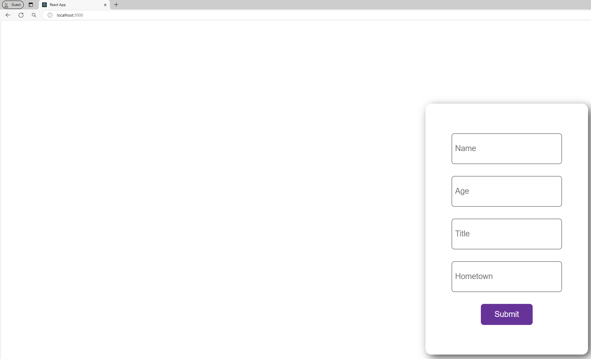
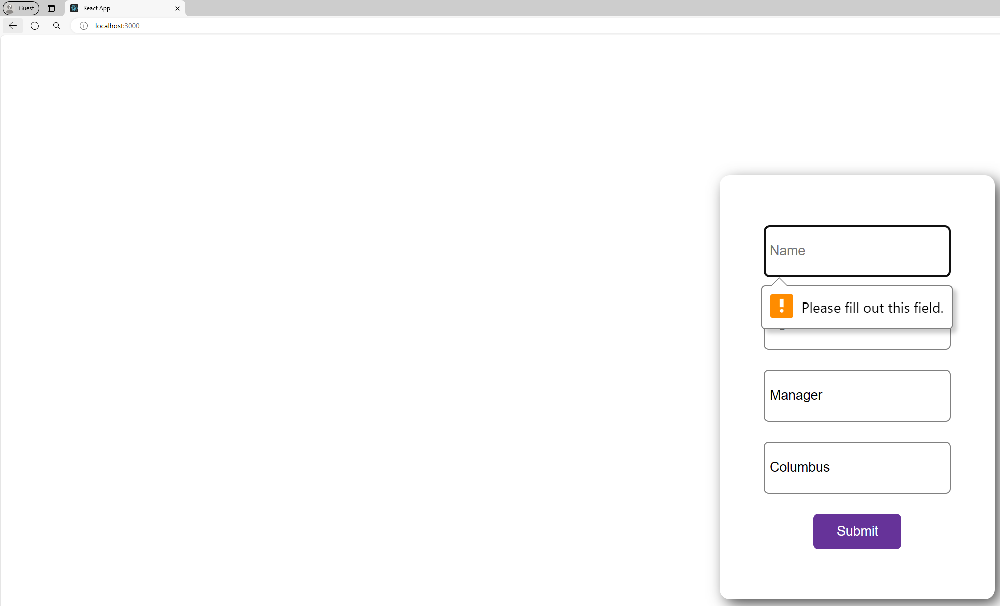
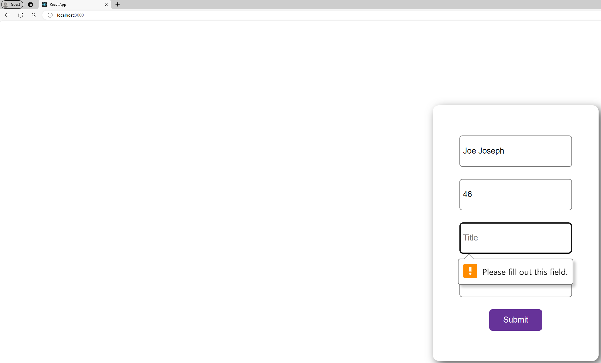
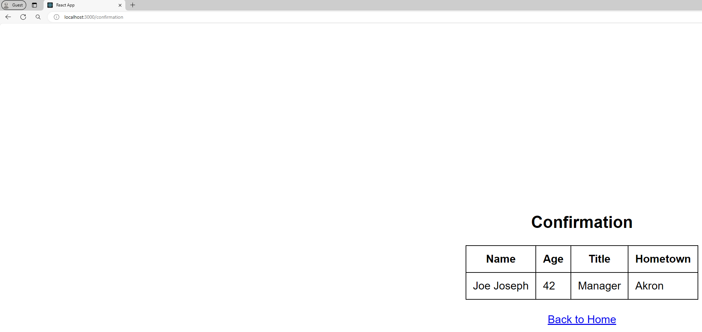
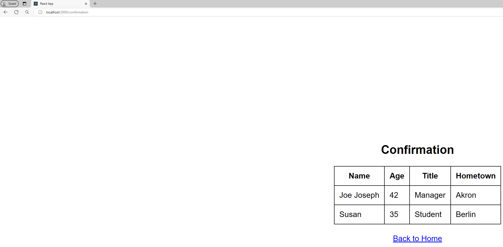

# ReactJS Screening Exercise Application

A sample ReactJS application accepts user inputs with dynamic validation enabled and display those values upon submission into second confirmation page. It retains the previous values in memory and both existing and new values are displayed in the confirmation page.

## How to run the application?
1) Install [`Node.js`](https://nodejs.org/en/download) for running `ReactJs` application
2) Install [`git`](https://git-scm.com/download/win) to clone this repository to run application locally
3) Clone this repository using the command `git clone https://github.com/saumyaeb/reactjs-exercise.git` in commandline or using VSCode/IntelliJ
4) Change the directory using the command `cd reactjs-exercise` to run application locally
5) Build and run application locally using the command `npm install` followed by `npm start` in commandline or run option in VSCode/IntelliJ
6) The application will successfully start locally and accessible using the url `http://localhost:3000/`
7) Press `Ctrl + C` to stop the application or select stop/kill option in VSCode/IntelliJ

## Application Screens
1) Landing/Home page

2) Validation upon submit for both `Name` and `Title`

3) Confirmation page with previous values

